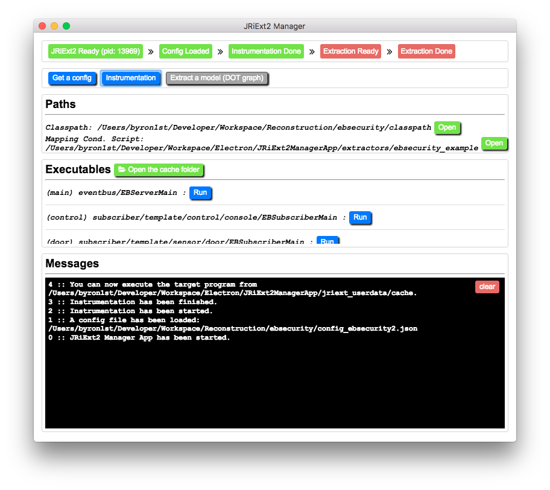
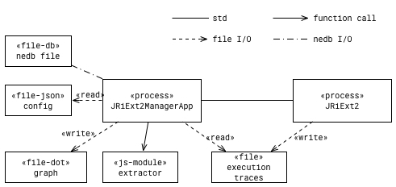
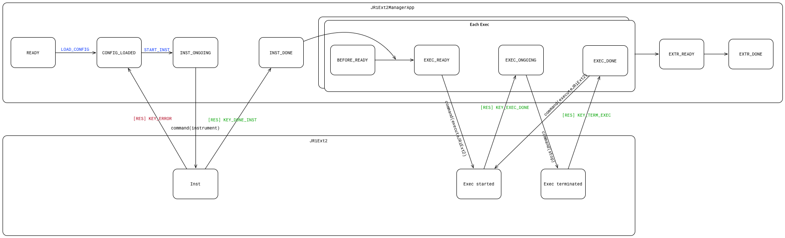
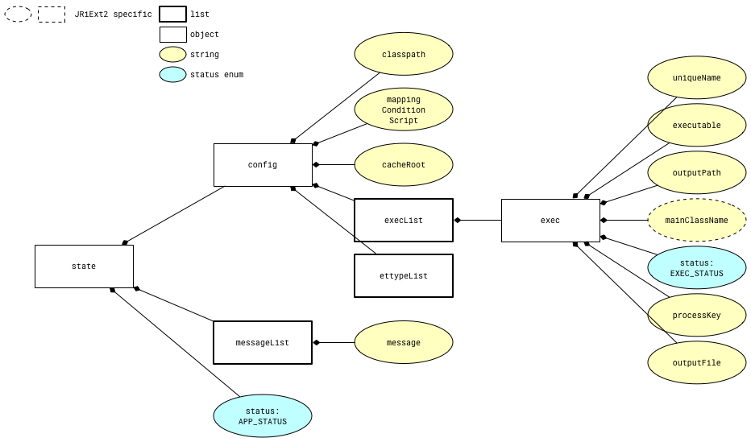

# JRiExt2ManagerApp

[JRiExt2](https://github.com/byron1st/jriext2)를 이용하여 자바 프로그램의 실행 데이터를 기록하기 위한 프로그램입니다. JRiExt2가 라이브러리 형태로 작성되어 있기 때문에, JRiExt2에 Execution Trace Type 정보를 비롯해서 각종 입력값들을 넣어주고, 출력값을 관리해줄 UI를 갖춘 프로그램이 필요한데, JRiExt2ManagerApp이 이런 역할을 수행합니다.

**주요 기술 스택**
* [React](https://facebook.github.io/react/)
* [Redux](https://github.com/reactjs/redux)
* [Electron](https://electron.atom.io)
* [Gulp](http://gulpjs.com)
* [NeDB](https://github.com/louischatriot/nedb)

## Architecture
### Overview (Context View Architecture)

JRiExt2ManagerApp은 JRiExt2를 서브 프로세스로 생성하게 되며, 둘 사이에는 `std` I/O로 메세지를 주고 받습니다. JRiExt2는 JRiExt2ManagerApp 프로그램이 실행되면서 바로 실행됩니다.

JRiExt2ManagerApp은 대상 프로그램의 경로, Execution Trace Type 정의들, 실행 정보(main 함수가 포함된 클래스 정보 등), Execution Trace들로부터 실행뷰 모델을 DOT 그래프 언어로 쓰기 위한 extractor 모듈 경로 등을 JSON 포멧으로 쓰여진 `config` 파일을 통해 읽어 들입니다.

JRiExt2가 생성한 Execution Trace들은 파일로 저장이 되고, 경로만 `std`로 전달됩니다. JRiExt2ManagerApp은 일단 문자열로 저장된 Execution Trace들을 읽어들여서 `nedb`의 파일 기반의 임베디드 데이터베이스에 저장합니다. 이 때, 각 레코드의 속성 정보는 `config`에 정의된 Execution Trace Type에 따라 결정됩니다. `nedb`는 NoSQL 데이터베이스이기 때문에 스키마가 고정되어 있지 않아 가능합니다.

마지막으로 자바스크립트 모듈로 정의된 `extractor`를 실행시켜서 DOT 그래프 언어 포멧으로 정의된 실행뷰 아키테처 모델을 출력합니다. `extractor`는 `nedb` 객체를 입력 받아 컴포넌트들 리스트를 식별하는 함수들과 `nedb` 객체와 식별된 컴포넌트 리스트를 입력 받아 커넥터들 리스트를 식별하는 함수들로 구성된다. 그리고 모듈은 최종적으로 이 컴포넌트 식별 함수들과 커넥터 식별 함수들의 리스트를 `export` 한다. 이때 각 Execution Trace Type 별로 1개의 식별 함수를 정의한다. 문자열로 출력된 DOT 그래프 언어 포멧의 파일은 [Viz.js 사이트](http://viz-js.com)나 OmniGraffle, Graphviz와 같은 프로그램을 통해 그래프 형태로 볼 수 있습니다.

### JRiExt2ManagerApp의 Status

JRiExt2ManagerApp은 어플리케이션의 상태를 변경해가며 기능을 수행합니다. 어플리케이션이 실행되고 JRiExt2를 서브 프로세스로 잘 실행된 상태가 초기 상태인 `READY` 상태입니다. 그 후 `config` 파일을 잘 읽어들이면, `CONFIG_LOADED` 상태가 됩니다. 이때, Instrumentation 버튼이 활성화됩니다. 버튼을 누르면, 어플리케이션은 `INST_ONGOING` 상태가 되고, JRiExt2에 커맨드를 보내 바이트코드 수정을 합니다. 완료가 되면 `INST_DONE` 상태가 되고, 실패하면 `CONFIG_LOADED` 상태로 변경됩니다.

만약 `INST_DONE` 상태가 되면, 이는 모든 `exec`의 상태를 `EXEC_READY`로 변경합니다. 여기서 `exec`는 `config` 파일에 main 함수가 포함된 클래스를 정의함으로써 정의된 '실행'을 의미합니다. 하나의 시스템에 여러 실행이 존재할 수 있는데, 예를 들면, 테스트를 위해 서버와 클라이언트를 같은 소스코드 베이스에서 실행할 수 있습니다. 이 경우 하나의 `exec`는 서버이고 다른 하나의 `exec`는 클라이언트입니다.

`exec`가 `EXEC_READY` 상태가 되면, Run 버튼이 활성화됩니다. 누르면 해당 main 클래스를 실행하여 대상 프로그램을 실행합니다. 프로그램이 실행되면 해당 `exec`의 상태는 `EXEC_ONGOING`으로 변경되며, Run 버튼은 Stop 버튼으로 변경됩니다. Stop 버튼을 누르거나 대상 프로그램이 종료되면, 해당 `exec`의 상태는 `EXEC_DONE`으로 변경됩니다. 모든 `exec`의 상태가 `EXEC_DONE`으로 변경되면, JRiExt2ManagerApp의 상태는 `EXTR_READY` 상태가 됩니다. 이 경우 Extract a model 버튼이 활성화됩니다. 누르면 DOT 파일을 생성하고 어플리케이션의 상태는 `EXTR_DONE`이 됩니다.

모든 상태는 현재 상태보다 더 과거로 돌아갈 경우, 그 동안의 진행 상황은 초기화됩니다.

어플리케이션의 상태와 `exec`의 상태는 `actions/type.js`에 정의되어 있으며, 각각 `reducers/StatusReducers.js`와 `reducers/ExecReducers.js`에서 다루어집니다.

### Store

JRiExt2ManagerApp은 [React](https://facebook.github.io/react/)와 [Redux](https://github.com/reactjs/redux)를 이용하여 개발되었습니다. 그렇기 때문에, Store를 통해 어플리케이션 전체의 state를 관리합니다.(위의 Status와는 별개의 개념입니다. 여기서 state는 React의 state를 의미하고, Store는 [Flux Architecture](https://facebook.github.io/flux/docs/overview.html)의 Store를 의미합니다.) JRiExt2ManagerApp의 Store 구조는 다음과 같습니다.

최상단의 state들에 대해서는 각각 Reducer들이 존재하고, `ConfigReducers.js`의 경우 하위에 `ExecReducers.js`를 갖고 있습니다.

## 주의사항
* 따로 앱으로 패키징이 되어 있지 않아서, Gulp를 이용해서 실행해야 합니다. `npm start`를 통해 실행할 수 있으며, Visual Studio Code를 쓴다면, <kbd>Cmd+Shift+B</kbd>를 이용하여 실행할 수 있습니다.
* 종종 JSON parsing 에러 팝업이 뜨는데, 무시해도 됩니다.
* extractors는 JRiExt2ManagerApp의 일부가 아닙니다.
* `main.js`에서 React Developer Tool 경로를 불러올 때, 경로가 존재하지 않으면 에러가 납니다. 실행에는 문제가 없으니 무시해도 됩니다.

## `config.json` 예제
* [`config.json`](config_netty.json): Netty 서버의 SecureChatServer 예제의 Process, Thread, Socket 연결 구조를 재구축하기 위해 사용한 `config` 파일입니다.
